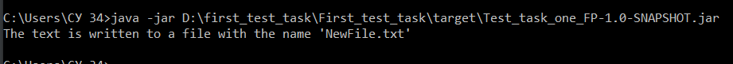

###Задача1

Имеется корневая папка. В этой папке могут находиться текстовые файлы, а также другие папки. В других папках также могут находиться текстовые файлы и папки(уровень вложенности может оказаться любым).
Найти все текстовые файлы, отсортировать их по имени и склеить содержимое в один текстовый файл.

###Требования к выполненным заданиям:
* Версия java любая любая из трёх: 8, 11, 17;
* После сборки проекта приложение должно быть готово для запуска одной командой.

